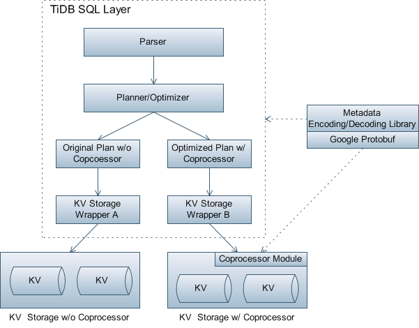
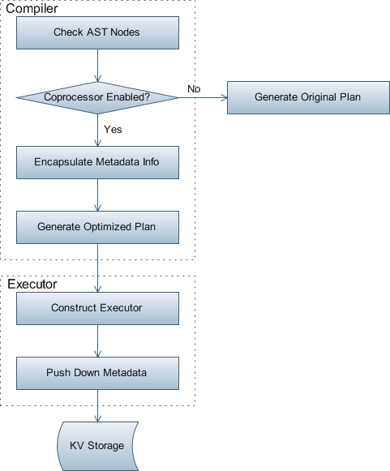

# About

This design document is an updated version of the origin design documents of PingCAP from early 2016.

# Overview

To the best of our knowledge, the idea of ***Coprocessor*** was first implemented in Google's BigTable, and ***Jeferry Dean***, a Google Fellow in the Systems Instrastructure Group, he explained ***BigTable Coprocessors*** in his keynotes [2]:

- Arbitrary code that runs run next to each tablet in table
	- as tablets split and move, coprocessor code automatically splits/moves too
- High-level call interface for clients
	- Unlike RPC, **calls addressed to rows or ranges of rows**
		- coprocessor client library resolves to actual locations
	- Calls across multiple rows automatically split into multiple parallelized RPCs
- Very flexible model for building distributed services
	- **automatic scaling, load balancing, request routing for apps**

Also, he mentioned some example coprocessor uses:

- Scalable metadata management for Colossus (next gen GFS-like file system)
- Distributed language model serving for machine translation system
- Distributed query processing for full-text indexing support
- Regular expression search support for code repository

More generally, the idea of ***Coprocessor*** can be concluded as ***Move Computation to Data***, and Apache HBase, the most well-known open-source implementation of Google's BigTable, also contains coprocessor implementation, the ideas are almost the same except some concept differences, e.g., HBase's **Region** is BigTable's **Tablet**. 

**TiDB** [1], a distributed database inspired by the design of Google [F1](http://research.google.com/pubs/pub41344.html), its SQL layer can support mutiple pluggable storage engines like **MySQL** via a well-defined suite of key-value data retrieval interfaces, and up to now, it can support **goleveldb**, **boltdb**, **gomdb** and **HBase**, and later it may support more storage engines like **CockroachDB** and etc.

In this design, we are talking about how to leverage the power of the storage engine's ***Coprocessor*** feature from the perspective of SQL layer, e.g., with the power of ***HBase Coprocessors***, at least but not limited to the optimizations below can be applied:

- SQL operators push down, like aggregation functions, join, etc.
- Check access permissions.
- ...

By contrast, to avoid misunderstandings, we have to clarify:

- We are not going to design or implement another ***Coprocessor*** feature from scratch, we are just saying if a storage engine provides this capability, how can TiDB's SQL layer use it for performance optimizations or other purposes.
- Our solution need to be generic, can support storage engines with ***Coprocessor*** capability, also those without ***Coprocessor*** capabilities.
- We will not introduce any new concepts or nouns, mostly we want is a generic framework to leverage existing capabilities up, and we want our framework extensible.

# Architecture

The following constraints need to be considered when designing our architecture:

- TiDB's SQL layer needs to support multiple storage engines with different capabilities, like **HBase**, which contains coprocessor support, also those simple ones without coprocessor support, like **goleveldb**.
- Storage engines may need to know how to encode/decode binary key-value data with database metadata information in order to do further computations, also storage engines may be written in different programming languages, like **golang**, **java** and etc.
- TiDB's SQL layer needs to be able to check the coprocessor capabilities of the underlying storage engines, and can generate optimized execution plans accordingly once storage engine provides a fast path.

Here below is the architecture to support ***Coprocessor*** feature:



# KV Interface Changes

Our KV interfaces need to be changed because:

- We need to know the capabilities of different storage engines, otherwise our planner don't know whether or not to generate optimized plans.
- For those storage engines support coprocessors, the SQL layer needs to deliever some `DB/Plan/Table/Column` metadata information to the storage layer, otherwise the storage layer don't know how to encode/decode actual data without that knowledge.

Actually, the noun `capability` could be more general, and this change is not only used for coprocessor feature, e.g., later some storage engines may be able to provide sampling statistics or data distribution information, which can be used by our optimizer to optimize execution plans.

## Methods to Identify Storage Engine Capabilities

In `tidb/kv/kv.go`:

```Go
// EnumFeatureName defines the feature name supported by the storage layer, which
// can be used as by the SQL layer for optimized plan generation or other purposes.
type EnumFeatureName int

const (
	// FeatureNameCoprocessorAggregation returns true if the underlying storage
	// layer supports coprocessor optimization for SQL aggregation operations.
	FeatureNameCoprocessorAggregation EnumFeatureName = iota + 1
	// FeatureNameCoprocessorAggregation returns true if the underlying storage
	// layer supports coprocessor optimization for SQL inner join operations.
	FeatureNameCoprocessorInnerJoin
)

// Feature is the interface returns if specified feature(s) can be supported.
type Feature interface {
	// IsSupported returns true if the specified feature can be supported by the
	// underlying storage layer, false otherwise.
	IsSupported(name EnumFeatureName) bool
}
```

## Methods to Deliever Metadata Information

In `tidb/kv/kv.go`:

```Go
// Coprocessor is the interface wraps all its related methods.
type Coprocessor interface {
	// PushDown delivers all metadata information needed for a specified coprocessor
	// feature to perform computation in the underlying storage layer.
	PushDown(name EnumFeatureName, metadata interface{})
}
```

# SQL Push Down Workflow

To support ***Coprocessor*** feature, TiDB's SQL layer needs to modify its `Planner/Optimizer` and `Executor` component, the general SQL push down workflow can be explained by the diagram below:



# Implementation Details

## Metadata Encoding/Decoding Library

We need to seperate the code to encode/decode raw binary data with metadata information to an independent library because:

- Storage layers need to depend on this library, if it's not independent, recursive dependencies can occur.
- The underlying storage layer may be implemented in multiple languages, not Golang only, so it's better to make this function part independent.

Back to the implementation, we will:

- Use Google protobuf for metadata encoding/decoding to shield language differences.
- `Golang`/`Java`/`C++` version for this library can be implemented first.

## Dual-Path Execution Plan Generation

As mentioned above,, TiDB's SQL layer can't assume the functionalies of the underlying storage layer, of course it needs to be transactional KV storage, while ***Coprocessor*** should be classfied as optional features, our `Planner/Optimizer` should be able to generate optimized plans accordingly, that is so called ***Dual-Path***.

Back to the implementation, we will:

- If a specified coprocesor feature is supported, the optimized execution path can be choosed, and metadata information needed by the underlying storage layer can be encapsulated and push down.
- Similar to online schema change, to support online KV storage upgrade, we can detect and refresh the feature list every several minutes, if a new feature is enabled after online upgradation, we can use it without restart the SQL layer.

## New Coprocessor Module Support

As we all know, if the underlying storage layer supports ***Coprocessor*** feature, like **HBase**, it usually means an extensible framework and some pre-existed modules, new functions usually means to support new modules.

From the implementation perspective, new coprocessor module support means the following steps:

- Use the mechanism provided by the storage layer to implement a module, and load it.
- Assign a new feature name for this module, e.g., `FeatureNameCoprocessorInnerJoin`.
- Modify the `Planner/Optimizer` of the SQL layer to add another optimized exeuction path for the new feature.
- Update the storage wrapper to return `true` for this feature.

# References

[1] [TiDB README](https://github.com/pingcap/tidb/blob/master/README.md)
<br/>
[2] [dean-keynote-ladis2009.pdf](https://www.cs.cornell.edu/projects/ladis2009/talks/dean-keynote-ladis2009.pdf)
<br/>
[3] [Apache HBase Coprocessor Intruduction](https://blogs.apache.org/hbase/entry/coprocessor_introduction)
<br/>
[4] [Apache HBase Coprocessors](http://hbase.apache.org/book.html#cp)
